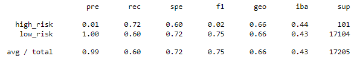
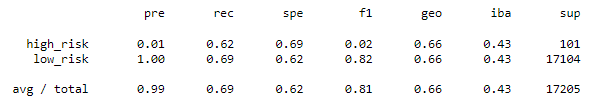
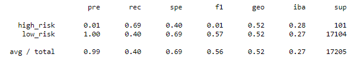
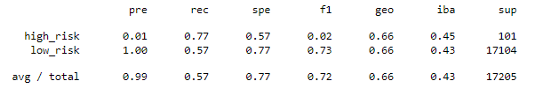
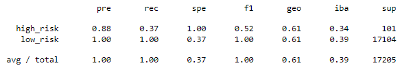
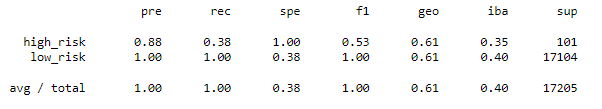
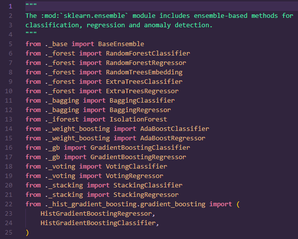

# Credit_Risk_Analysis

## Overview

The purpose of this analysis was to utilize Python's sklearn and imbalanced_learn modules to use various forms of supervised machine learning to predict credit risk from a given set of loan data.

## Results

Six machine learning models were used in this analysis.  For each, balanced accuracy score, precision, and recall were computed.

Naive Random Oversampling:

- Balanced accuracy score: 0.6614
- Average precision: 0.99
- High-risk precision: 0.01
- Low-risk precision: 1.00
- Average recall: 0.60
- High-risk recall: 0.72
- Low-risk recall: 0.60

SMOTE Oversampling:

- Balanced accuracy score: 0.6581
- Average precision: 0.99
- High-risk precision: 0.01
- Low-risk precision: 1.00
- Average recall: 0.69
- High-risk recall: 0.62
- Low-risk recall: 0.69

Cluster Centroids Undersampling:

- Balanced accuracy score: 0.5443
- Average precision: 0.99
- High-risk precision: 0.01
- Low-risk precision: 1.00
- Average recall: 0.40
- High-risk recall: 0.69
- Low-risk recall: 0.40

SMOTEENN Combination Sampling:

- Balanced accuracy score: 0.6711
- Average precision: 0.99
- High-risk precision: 0.01
- Low-risk precision: 1.00
- Average recall: 0.57
- High-risk recall: 0.77
- Low-risk recall: 0.57

Random Forest Classifier:

- Balanced accuracy score: 0.6830
- Average precision: 1.00
- High-risk precision: 0.88
- Low-risk precision: 1.00
- Average recall: 1.00
- High-risk recall: 0.37
- Low-risk recall: 1.00

AdaBoost Classifier:

- Balanced accuracy score: 0.6880
- Average precision: 1.00
- High-risk precision: 0.88
- Low-risk precision: 1.00
- Average recall: 1.00
- High-risk recall: 0.38
- Low_risk recall: 1.00

## Summary

### Summary and Recommendation

When comparing our models, we must decide which metrics we value more.  In this case, since we are working with loan data, high-risk recall appears to be the most important.  This is because a defaulted loan is much more costly than an average one is profitable.  Thus, given a high-risk loan, we prioritze our ability to detect it.  Loans captured by our model can be re-evaluated by decision makers at LendingClub, so if extra low-risk loans are captured by the model, it is not the worst thing as they could still end up approved. Since the dataset is imbalanced, we know that the high-risk components of precision and recall will not affect averages significantly.  This means that we will not value average precision or recall heavily, since they are dominated by the low-risk components.

At first glance, we notice decent similarity in metrics between two pairs of models.  The Native Random Oversampling model and SMOTE model are similar to one another, while the Random Forrest Classifier and AdaBoost Classifier also appear similar.  This makes sense, as the first pair are both oversampling models and the second pair are both ensemble models.  The ensemble classifier models stand out due to their poor high-risk recall.  At 0.37 and 0.38, they score much lower than any other model in that metric.  Their high-risk precision metrics are above all of the other models, but with such low recall, we see that this is accomplished by not identifying enough potential high-risk loans.  These models can be taken out of consideration for our recommendation.

When looking at balanced accuracy scores, five of our models sit between 65% and 69%, with only the Cluster Centroids undersampling model scoring below 55%.  Since it does not have a significantly higher high-risk recall compared to our other remaining models, we can decide to eliminate this one from consideration as well.

Our three remaining models show almost identical precision, with the accuracy scores being very close as well.  Out of the three, the SMOTEENN combination sampling model performs the best, with a high-risk recall 0.05 higher than the second best.  It also has the highest balanced accuracy score of the group, nudging us further towards this model.  With these considerations, we recommend the SMOTTEENN model as the best of our six options to predict credit risk.

### Challenge Difficulties

This analysis differs from the challenge starter code's pre-printed output.  The initial dataframe and split data matches, but even after using random_state=1 consistently, the balanced accuracy scores, confusion matrices, and classifcation reports contained differences compared to the starter code output.  Because the challenge did not specify, I mainly used default parameters for the different models.

Most notably, attempts to import both the BalancedRandomForestClassifier and the EasyEnsembleClassifier resulted in an ImportError that referenced my environment files.  Specifically, the error stated that sklearn.ensemble did not contain either of these methods in its _init_.py file.  Upon checking, I found this to be correct.

With neither present, I tried to do what appeared to be the closest thing and selected RandomForestClassifier and AdaBoostClassifier to use instead.  This led to greater output differences than those in the first two deliverables.  It is very possible that my conclusions are different as a result.  Any advice on errors in my process would be extremely appreciated.
